# Splash StablePool Protocol

Stablecoin exchanges require deep liquidity and no price slippage (best case scenario).
Classic constant product Automated Market Makers pool (AMM pools) are good for highly volatile assets, however,
constant product invariant formula ($xy = c$) doesn't meet the requirements above for stablecoins.
A more complex invariant as the heart of the AMM pool is needed to effectively utilize stablecoins' liquidity.

The most appropriate invariant for constructing AMM pools with stablecoins is the
StableSwap invariant proposed by the [Curve protocol](https://classic.curve.fi/files/stableswap-paper.pdf).
Curve's invariant combines the pros and cons of the simplest AMM invariants and in its sense is a superposition of
constant sum $\sum x_i = c$ and constant product $\prod x_i = c$ formulas:

```math
\begin{equation}
A n^n \sum x_i + D = D A n^n + \frac{D^{n + 1}}{n^n \prod x_i}
\end{equation}
```

where $x_i$ represents the balance of $i^{th}$ token in the pool, $D = \sum x_i$
is the total amount of tokens when they have an equal price i.e. at equilibrium point,
$A$ is a parameter and $n$ is the number of tokens in the pool.

The StableSwap invariant indeed provides both low price slippage
and deep liquidity around the equilibrium point, it can be clearly seen from the direct comparison:


The shape of the StableSwap invariant's curve strongly depends on the value of the parameter $A$.
It's called an “amplification coefficient”, the lower it is, the closer the invariant is to the constant product:


If the price appears to be shifted from the equilibrium point, the invariant
starts operating in a suboptimal point, still, however, providing some liquidity (in
most cases larger than constant product invariant, if optimal $A$ was correctly found).
At any price, this invariant, just like the constant-product one, would
provide some liquidity (unlike the constant-sum invariant).

Value of the parameter $A$ should be chosen in such a way, that the price remains favorable for traders
playing on arbitrage, and, at the same time, trading volume (due to the low fees)
remains large enough for liquidity providers to receive high returns (this can be simulated using historical data).

## Invariant calculation

Let us write again the invariant for the effective stablecoin exchange:

```math
\begin{equation}
A n^n \sum x_i + D = D A n^n + \frac{D^{n + 1}}{n^n \prod x_i}
\end{equation}
```

Parameters $n$ and $A$ are constants, thus, set of variables involved in the
invariant calculation is $((x_i)_{i = 1}^{n}, D)$.
However, analytically calculate the value of $D$ when all others values are known
is possible only for $n = 2$.
When pool consists of $n = 3$ assets and more the only way to calculate target value of the
invariants is to solve it numerically.
Numerical solution methods are usually used to solve equations that are too difficult for us to solve by hand.
Each method is an iterative process that can approximate solutions to an equation with a predefined accuracy.

There are many numerical methods to choose from, so let us fix the requirements for the particular problem.
A solution algorithm for the StableSwap invariant must be:

- Effective (small number of iterations and low memory consumption);
- Precise (with precision to a discrete unit of the target variable).

The simplest numerical method that satisfies the efficiency requirements is the well-known Newton-Raphson Method.
To find the roots of the equation $f(x) = 0$, the following equation is iterated until a sufficiently precise value is
reached:

```math
\begin{equation}
x_{n + 1} = x_n - \frac{f(x_n)}{f'(x_n)}
\end{equation}
```

where $f(x_n)$ is continuously differentiable in the vicinity of the root (StableSwap satisfies this property).

Let’s say the trader wants to know the amount of $j$ tokens he will
receive for trading $\delta x_i ~(i \neq j)$ amount of token $i$.
In this case, the input token is $i$, and the output token
is $j$. The updated amount of $i$ in the pool is $x = x_i + \delta x_i$.
Since the token amounts always need to follow the StableSwap invariant,
updated $j$ token amount $x_j = y$ can be calculated by numerically solving equation
for $y$ with fixed amount of $i$ equal to $x$.
Let’s rearrange the invariant's equation:

```math
\begin{equation}
f(y) = y^2 + (b - D)y - c = 0,
\end{equation}
```

where

```math
b = S + \frac{D}{Ann},~~~~~c=\frac{D^{n + 1}}{n^n P Ann},
 ~~~~~ S = \sum_{i \not = j}^{n} x_i, ~~~~~ and ~~~~~ P = \prod_{i \not = j}^{n} x_i
```

The root of the above equation can be calculated using Newton’s method by iterating the below equation until
convergence:

```math
\begin{equation}
y_{n + 1} = y_n - \frac{y_n^2 + (b - D) y - c}{2 y_n + b - D} = \frac{y_n^2 + c}{2 y_n + b - D}
\end{equation}
```

Iteration obviously doesn't have to be infinite.
The condition for stopping the numerical calculation procedure is $y_{n + 1} - y_{n} <= 1$.
However, $1$ is just the minimal grid step and the step calculated from Newton’s method may be less than $1$ in the
last iterations.

Finally, the amount of token $j$ to be received by the trader can be calculated as ${dy = y_{init} - y_{fin}}$,
where $y_{init}$ is the balance of token $j$
before the trade and $y_{fin}$ is the updated balance calculated from equation above.

The value of parameter $D$ is calculated by solving the invariant in the same way as described above.
Given all other parameters are constant, the function $f(D)$, which a polynomial function of degree ${n + 1}$
can be represented as

```math
\begin{equation}
f(D) = \frac{D^{n + 1}}{n^n \prod x_i} + (Ann - 1) D - Ann S = 0
\end{equation}
```

where $S = \sum x_i$. The derivative of above function is ${f'(D) = (n + 1) D_P / D + (Ann - 1)}$,
where ${D_P = \frac{D^{n + 1}}{n^n \prod x_i}}$.
Therefore, the root of ${f(D) = 0}$
can be calculated using Newton's formula by iterating below equation until convergence:

```math
\begin{equation}
D_{n + 1} = D_n - \frac{f(D_n)}{f'(D_n)} = \frac{(Ann S + n D_P) D_n}{(Ann - 1) D_n+(n + 1) D_P}
\end{equation}
```

## Protocol functionality

**Actions**

1. Deposit liquidity (tokens can be deposited only according to the current pool ratio);
2. Redeem liquidity (tokens can be redeemed only according to the current pool ratio);
3. Swap from token `X`  to `Y`.

**Features**

1. Two types of fees are applied to every swap operation:
    1. Liquidity provider fees;
    2. Protocol fees (treasury for Splash token holders).
2. All fees are accumulated in the pool;
3. Support of DAO-actions:
    1. Update liquidity provider fee;
    2. Update protocol fee;
    3. Update treasury address;
    4. Withdrawn protocol fees to distribute between Splash token holders;
    5. Update stake credential;
    6. Update amplification coefficient.
4. Main protocol validators are StablePool and StablePool-proxy DAO,
   order contracts can be modified by users.

**Restrictions**

1. Fees rates are equal for all assets in the pool.

## eUTXO protocol design

General idea is to put all numerical calculations described above into off-chain code and check on-chain
only validity of the StableSwap invariant with the correct parameters and balances.
More details about off-chain flow can be found below in the descriptions of off-chain operator's actions in the
AMM-orders TX images.

### Stable3Pool

#### Data

Data related to the pool (`Immutable` stands for pool configuration parameters) is as follows:

| Field                         | Type            | Description                                                                                                                             | State       |
|-------------------------------|-----------------|-----------------------------------------------------------------------------------------------------------------------------------------|-------------|
| `pool_nft`                    | `Asset`         | Identifier of the pool                                                                                                                  | `Immutable` |
| `n`                           | `Int`           | Number of tradable assets in the pool                                                                                                   | `Immutable` |
| `tradable_assets`             | `List<Asset>`   | Identifiers of the tradable assets                                                                                                      | `Immutable` |
| `tradable_tokens_multipliers` | `List<Int>`     | Precision multipliers for calculations, i.e. precision / decimals. Precision must be fixed as maximum value of tradable tokens decimals | `Immutable` |
| `lp_token`                    | `Asset`         | Identifier of the liquidity token asset                                                                                                 | `Immutable` |
| `ampl_coeff_is_editable`      | `Bool`          | Flag if amplification coefficient is editable                                                                                           | `Immutable` |
| `lp_fee_is_editable`          | `Bool`          | Flag if liquidity provider fee is editable                                                                                              | `Immutable` |
| `an2n`                        | `Integer`       | Amplification coefficient multiplied by n ^ (2n)                                                                                        | `Mutable`   |
| `lp_fee_num`                  | `Integer`       | Numerator of the liquidity provider fee                                                                                                 | `Mutable`   |
| `protocol_fee_num`            | `Integer`       | Numerator of the protocol fee share                                                                                                     | `Mutable`   |
| `dao_stabe_proxy_witness`     | `ScriptHash`    | Information about the DAO script, which audits the correctness of the "DAO-actions" with stable pool                                    | `Mutable`   |
| `treasury_address`            | `ScriptKeyHash` | Treasury address                                                                                                                        | `Mutable`   |
| `protocol_fees`               | `List<Int>`     | Collected (and currently available) protocol fees in the tradable assets native units                                                   | `Mutable`   |
| `alpha`                       | `Integer`       | Constant to optimize invariant validation                                                                                               | `Mutable`   |
| `betta`                       | `Integer`       | Constant to optimize invariant validation                                                                                               | `Mutable`   |

#### Tokens

In case with `n=3` tradable assets pool's value (excluding ADA will be as follows):

| Name       | Description                            | Amount                                              |
|------------|----------------------------------------|-----------------------------------------------------|
| `pool_NFT` | NFT to identify the pool               | `1`                                                 |
| `X`        | Base asset token                       | At least `1`                                        |
| `Y`        | First quote asset token                | At least `1`                                        |
| `Z`        | Second quote asset token               | At least `1`                                        |
| `LP`       | Liquidity token of the `X/Y/Z` triplet | Emission must be `FFFFFFFFFFFFFFFFFFFFFFFFFFFFFFFF` |

#### Validator

Pool validator must validate that:

1. Pool input is valid;
2. Pool address is preserved;
3. Pool NFT is preserved;
4. Immutable pool configuration parameters are preserved;
5. No more tokens are in the pool output;
6. Action is valid:
    1. In case of AMM action (Deposit/Redeem/Swap):
        1. Pool adjustable params are preserved;
        2. Action is performed according to the StableSwap logic;
        3. Valid protocol fees;
        4. Valid liquidity provider fees;
        5. Valid tradable and liquidity token deltas;
        6. Calculations were performed according to the StableSwap invariant with pool params.
    2. In case of DAO-actions:
        1. Action is confirmed by the proxy-StablePool DAO script;
        2. Action is confirmed by the Splash DAO voting script.

### Deposit



##### Data

With arbitrary amount of tokens deposited:

| Field                    | Type                  | Description                                 |
|--------------------------|-----------------------|---------------------------------------------|
| `pool_nft`               | `Asset`               | Identifier of the target pool               |
| `redeemer`               | `VerificationKeyHash` | Redeemer public key                         |
| `min_expected_lp_amount` | `Int`                 | Minimum expected amount of liquidity tokens |

##### Tokens

In case with `n=3` tradable assets order's value (excluding ADA will be as follows):

| Name | Description        | Amount                                  |
|------|--------------------|-----------------------------------------|
| `X`  | Base asset         | Arbitrary, but at least to pay the fees |
| `Y`  | First quote asset  | Arbitrary, but at least to pay the fees |
| `Z`  | Second quote asset | Arbitrary, but at least to pay the fees |

#### Validator

Deposit order validator must validate that:

1. Order interacts with the desired pool;
2. Not less than expected `LP` token amount is received by redeemer;
3. Redeemer is valid.

### Redeem



##### Data

With arbitrary amount of tokens deposited:

| Field                                   | Type                  | Description                                  |
|-----------------------------------------|-----------------------|----------------------------------------------|
| `pool_nft`                              | `Asset`               | Identifier of the target pool                |
| `redeemer`                              | `VerificationKeyHash` | Redeemer public key                          |
| `expected_assets`                       | `List<Asset>`         | Expected assets                              |
| `min_expected_received_assets_balances` | `List<Int>`           | Minimum expected balances of expected tokens |
| `min_expected_lp_change`                | `Int`                 | Minimum expected balances of `LP` tokens     |

##### Tokens

| Name | Description     | Amount    |
|------|-----------------|-----------|
| `LP` | Liquidity token | Arbitrary |

#### Validator

Redeem order validator must validate that:

1. Order interacts with the desired pool;
2. Expected amounts of expected tokens are received by redeemer;
3. Valid change is received by redeemer;
4. Redeemer is valid.

### Redeem Uniform

Redeem in the current balances ration of the pool doesn't assume change of liquidity tokens.

#### Data

| Field                                   | Type                  | Description                                      |
|-----------------------------------------|-----------------------|--------------------------------------------------|
| `pool_nft`                              | `Asset`               | Identifier of the target pool                    |
| `redeemer`                              | `VerificationKeyHash` | Redeemer public key                              |
| `min_expected_received_assets_balances` | `List<Int>`           | Minimum expected balances of all tradable tokens |

##### Tokens

| Name | Description | Amount    |
|------|-------------|-----------|
| `LP` | Base asset  | Arbitrary |

#### Validator

Redeem order validator must validate that:

1. Order interacts with the desired pool;
2. Expected amounts of all tokens are received by redeemer;
3. Redeemer is valid.

### Swap


Swap order is implemented as uniform Splash AMM-order.

### StablePool-proxy DAO

The StablePool-proxy DAO contract is a separate contract that verifies the correctness of non-AMM actions (AMM actions
are: `deposit/redeem/swap`). It allows to add different logic to the protocol without significantly affecting the main
pool contract.
The pool will only verify that the corresponding script and Splash DAO voting confirmed action.

#### Data

| Field      | Type    | Description                   |
|------------|---------|-------------------------------|
| `pool_nft` | `Asset` | Identifier of the target pool |

#### Validator

Proxy-DAO contract must validate that:

1. Pool invariant values are preserved;
2. `LP` tokens are preserved
3. Action is valid. The proxy-DAO contract ensures the correctness of the following actions:
    1. Update liquidity provider fee;
    2. Update protocol fee;
    3. Update treasury address;
    4. Withdrawn protocol fees to distribute between Splash token holders;
    5. Update stake credential;
    6. Update amplification coefficient.