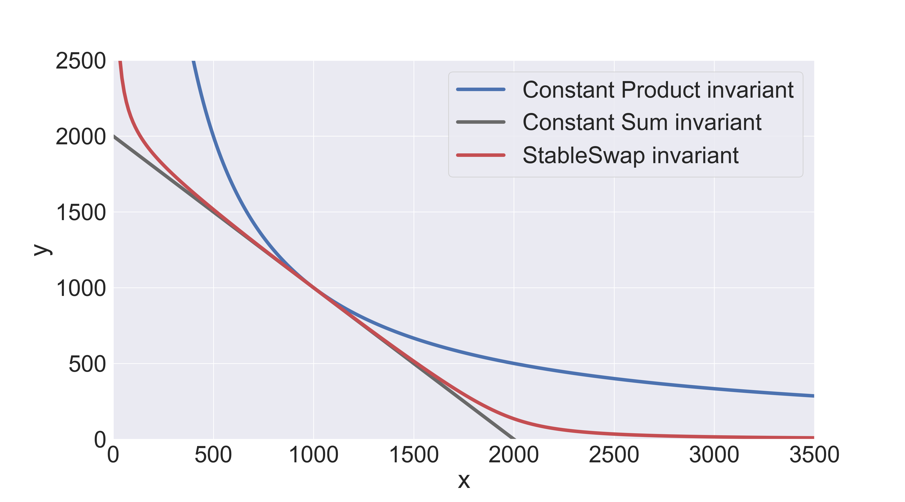

# Splash StablePool Protocol

Stablecoin exchanges require deep liquidity and no price slippage (best case scenario).
Classic constant product Automated Market Makers pool (AMM pools) are good for highly volatile assets, however,
constant product invariant formula ($xy = c$) doesn't meet the requirements above for stablecoins.
A more complex invariant as the heart of the AMM pool is needed to effectively utilize stablecoins' liquidity.

The most appropriate invariant for constructing AMM pools with stablecoins is the
StableSwap invariant proposed by the [Curve protocol](https://classic.curve.fi/files/stableswap-paper.pdf).
Curve's invariant combines the pros and cons of the simplest AMM invariants and in its sense is a superposition of
constant sum $\sum x_i = c$ and constant product $\prod x_i = c$ formulas:

```math
\begin{equation}
A n^n \sum x_i + D = D A n^n + \frac{D^{n + 1}}{n^n \prod x_i}
\end{equation}
```

where $x_i$ represents the balance of $i^{th}$ token in the pool, $D = \sum x_i$
is the total amount of tokens when they have an equal price i.e. at equilibrium point,
$A$ is a parameter and $n$ is the number of tokens in the pool.

The StableSwap invariant indeed provides both low price slippage
and deep liquidity around the equilibrium point, it can be clearly seen from the direct comparison:


The shape of the StableSwap invariant's curve strongly depends on the value of the parameter $A$.
It's called an “amplification coefficient”, the lower it is, the closer the invariant is to the constant product:


If the price appears to be shifted from the equilibrium point, the invariant
starts operating in a suboptimal point, still, however, providing some liquidity (in
most cases larger than constant product invariant, if optimal $A$ was correctly found).
At any price, this invariant, just like the constant-product one, would
provide some liquidity (unlike the constant-sum invariant).

Value of the parameter $A$ should be chosen in such a way, that the price remains favorable for traders
playing on arbitrage, and, at the same time, trading volume (due to the low fees)
remains large enough for liquidity providers to receive high returns (this can be simulated using historical data).

## Invariant calculation

Let us write again the invariant for the effective stablecoin exchange:

```math
\begin{equation}
A n^n \sum x_i + D = D A n^n + \frac{D^{n + 1}}{n^n \prod x_i}
\end{equation}
```

Parameters $n$ and $A$ are constants, thus, set of variables involved in the
invariant calculation is $\{\{x_i\}_{i = 1}^{n}, D\}$.
However, analytically calculate the value of $D$ when all others values are known
is possible only for $n = 2$.
When pool consists of $n = 3$ assets and more the only way to calculate target value of the
invariants is to solve it numerically.
Numerical solution methods are usually used to solve equations that are too difficult for us to solve by hand.
Each method is an iterative process that can approximate solutions to an equation with a predefined accuracy.

There are many numerical methods to choose from, so let us fix the requirements for the particular problem.
A solution algorithm for the StableSwap invariant must be:

- Effective (small number of iterations and low memory consumption);
- Precise (with precision to a discrete unit of the target variable).

The simplest numerical method that satisfies the efficiency requirements is the well-known Newton-Raphson Method.
To find the roots of the equation $f(x) = 0$, the following equation is iterated until a sufficiently precise value is
reached:

```math
\begin{equation}
x_{n + 1} = x_n - \frac{f(x_n)}{f'(x_n)}
\end{equation}
```

where $f(x_n)$ is continuously differentiable in the vicinity of the root (StableSwap satisfies this property).

Let’s say the trader wants to know the amount of $j$ tokens he will
receive for trading $\delta x_i ~(i \neq j)$ amount of token $i$ using only integer operations.
In this case, the input token is $i$, and the output token
is $j$. The updated amount of $i$ in the pool is $x = x_i + \delta x_i$.
Since the token amounts always need to follow the StableSwap invariant,
updated $j$ token amount $x_j = y$ can be calculated by numerically solving equation
for $y$ with fixed amount of $i$ equal to $x$.
Let’s rearrange the invariant's equation:

```math
\begin{equation}
f(y) = y^2 + (b - D)y - c = 0,
\end{equation}
```

where

```math
b = S + \frac{D}{Ann},~~~~~c=\frac{D^{n + 1}}{n^n P Ann},
 ~~~~~ S = \sum_{i \not = j}^{n} x_i, ~~~~~ and ~~~~~ P = \prod_{i \not = j}^{n} x_i
```

The root of the above equation can be calculated using Newton’s method by iterating the below equation until
convergence:

```math
\begin{equation}
y_{n + 1} = y_n - \frac{y_n^2 + (b - D) y - c}{2 y_n + b - D} = \frac{y_n^2 + c}{2 y_n + b - D}
\end{equation}
```

Iteration obviously doesn't have to be infinite.
The condition for stopping the numerical calculation procedure is $y_{n + 1} - y_{n} <= 1$.
However, $1$ is just the minimal grid step and the step calculated from Newton’s method may be less than $1$ in the
last iterations.

Finally, the amount of token $j$ to be received by the trader can be calculated as ${dy = y_{init} - y_{fin}}$,
where $y_{init}$ is the balance of token $j$
before the trade and $y_{fin}$ is the updated balance calculated from equation above.

The value of parameter $D$ is calculated by solving the invariant in the same way as described above.
Given all other parameters are constant, the function $f(D)$, which a polynomial function of degree ${n + 1}$
can be represented as

```math
\begin{equation}
f(D) = \frac{D^{n + 1}}{n^n \prod x_i} + (Ann - 1) D - Ann S = 0
\end{equation}
```

where $S = \sum x_i$. The derivative of above function is ${f'(D) = (n + 1) D_P / D + (Ann - 1)}$,
where ${D_P = \frac{D^{n + 1}}{n^n \prod x_i}}$.
Therefore, the root of ${f(D) = 0}$
can be calculated using Newton's formula by iterating below equation until convergence:

```math
\begin{equation}
D_{n + 1} = D_n - \frac{f(D_n)}{f'(D_n)} = \frac{(Ann S + n D_P) D_n}{(Ann - 1) D_n+(n + 1) D_P}
\end{equation}
```

## Protocol functionality

**AMM Actions**

1. Deposit liquidity (tokens can be deposited only according to the current pool ratio);
2. Redeem liquidity (tokens can be redeemed only according to the current pool ratio);
3. Swap from token $i$ to $j$.

**Features**

1. Two types of fees are applied to every swap operation:
    1. Liquidity provider fees;
    2. Protocol fees (treasury for Splash token holders).
2. All fees are accumulated in the pool;
3. Support of DAO-actions:
    1. Update liquidity provider fee;
    2. Update protocol fee;
    3. Update treasury address;
    4. Withdrawn protocol fees to distribute between Splash token holders;
    5. Update stake credential;
    6. Update amplification coefficient.
4. Main protocol validators are pool and proxy-DAO,
   order contracts can be modified by users.

**Restrictions**

1. Fees rates are equal for all assets in the pool, i.e. no bidirectional fees support.

## eUTXO protocol design

General idea of is to put all AMM-calculations described above into off-chain code and check on-chain
only validity of the StableSwap invariant with a given parameters and balances.
More details about off-chain flow can be found below in the descriptions of off-chain operator's actions in the
AMM-orders TX images.

To optimize the code, we divided the pool contracts as follows:

- Pool T2T - main pool validator for pool with 2 tradable assets (`X/Y`), the validator ensures that the reserves are
  safu;
- Pool T2T exact - main pool validator for pool with 2 tradable assets (`X/Y`). Special exact math validation
  implementation: the pool only allows actions that exactly match the math of the StableSwap equation;
- Pool T2T2T - main pool validator for pool with 2 tradable assets (`X/Y/Z`), the validator ensures that the reserves
  are safu.

**Note:** the native asset can be one of tradable assets in any pool.

Each pool has a proxy-DAO contract:

- Proxy-DAO T2T - validates correctness of DAO-actions in the Pool T2T / Pool T2T exact pool;
- Proxy-DAO T2T2T - validates correctness of DAO-actions in the Pool T2T2T pool.

### Pool T2T / Pool T2T exact

#### Data

Data related to the pool (`Immutable` stands for pool configuration parameters) is as follows:

| Field                     | Type         | Description                                                                                                                                            | State                                          |
|---------------------------|--------------|--------------------------------------------------------------------------------------------------------------------------------------------------------|------------------------------------------------|
| `pool_nft`                | `Asset`      | Identifier of the pool                                                                                                                                 | `Immutable`                                    |
| `an2n`                    | `Integer`    | StableSwap invariant amplification coefficient multiplied by `n ^ (2n)`, where `n` is the number of tradable assets                                    | `Mutable` if  `ampl_coeff_is_editable == True` |
| `asset_x`                 | `Asset`      | Identifier of the tradable asset                                                                                                                       | `Immutable`                                    |
| `asset_y`                 | `Asset`      | Identifier of the tradable asset                                                                                                                       | `Immutable`                                    |
| `multiplier_x`            | `Integer`    | Precision multipliers for calculations, i.e. `precision / decimals_x`, where `precision` must be fixed as a maximum value of tradable assets decimals  | `Immutable`                                    |
| `multiplier_y`            | `Integer`    | Precision multipliers for calculations, i.e. `precision / decimals_y` , where `precision` must be fixed as a maximum value of tradable assets decimals | `Immutable`                                    |
| `lp_token`                | `Asset`      | Identifier of the liquidity token, representing user's share in the pool                                                                               | `Immutable`                                    |
| `ampl_coeff_is_editable`  | `Bool`       | Flag if amplification coefficient is editable                                                                                                          | `Immutable`                                    |
| `lp_fee_is_editable`      | `Bool`       | Flag if liquidity provider fee is editable                                                                                                             | `Immutable`                                    |
| `lp_fee_num`              | `Integer`    | Numerator of the liquidity provider fee                                                                                                                | `Mutable`    if  `lp_fee_is_editable == True`  |
| `protocol_fee_num`        | `Integer`    | Numerator of the protocol fee share                                                                                                                    | `Mutable`                                      |
| `dao_stabe_proxy_witness` | `ScriptHash` | Information about the DAO script, which audits the correctness of the "DAO-actions" with stable pool                                                   | `Mutable`                                      |
| `treasury_address`        | `ScriptHash` | Treasury address                                                                                                                                       | `Mutable`                                      |
| `protocol_fees_x`         | `Integer`    | Collected (and currently available) protocol fees in the tradable assets native units                                                                  | `Mutable`                                      |
| `protocol_fees_y`         | `Integer`    | Collected (and currently available) protocol fees in the tradable assets native units                                                                  | `Mutable`                                      |

#### Tokens

Pool's value in case of token to token pool (excluding native asset):

| Name       | Description                       | Amount                                 |
|------------|-----------------------------------|----------------------------------------|
| `pool_NFT` | NFT to identify the pool          | `1`                                    |
| `X`        | Base asset                        | Positive                               |
| `Y`        | First quote asset                 | Positive                               |
| `LP`       | Liquidity token of the `X/Y` pair | Emission must be `9223372036854775807` |

#### Validator

Pool validator must validate that:

1. Pool input is valid;
2. Pool address is preserved;
3. Pool NFT is preserved;
4. Immutable pool configuration parameters are preserved;
5. No more tokens are in the pool output;
6. Action is valid:
    1. In case of Swap action:
        1. Pool's mutable params are preserved;
        2. Not less than required quote protocol fees was paid;
        3. Non-quote protocol fees are preserved;
        4. StableSwap invariant value has not decreased (includes validation of the quote liquidity provider fees).
    2. In case of Deposit (Redeem) action:
        1. Pool's mutable params are preserved;
        2. No more than allowed `LP` tokens was given (Not less than required `LP` tokens was received);
        3. Protocol fees don't decrease;
    3. In case of DAO-actions:
        1. Action is confirmed by the proxy-StablePool DAO script;
        2. Action is confirmed by the Splash DAO voting script.

**Note:** For Pool T2T exact in case of Deposit (Redeem) action validations 6.2.2 and  6.2.3 
is strict and in case of Swap action validation 6.1.4 checks that invariant value is exactly between final and shifted
by 'max_swap_error' states.

### Pool T2T2T

#### Data

| Field                     | Type         | Description                                                                                                                                            | State                                          |
|---------------------------|--------------|--------------------------------------------------------------------------------------------------------------------------------------------------------|------------------------------------------------|
| `pool_nft`                | `Asset`      | Identifier of the pool                                                                                                                                 | `Immutable`                                    |
| `an2n`                    | `Integer`    | StableSwap invariant amplification coefficient multiplied by `n ^ (2n)`, where `n` is the number of tradable assets                                    | `Mutable` if  `ampl_coeff_is_editable == True` |
| `asset_x`                 | `Asset`      | Identifier of the tradable asset                                                                                                                       | `Immutable`                                    |
| `asset_y`                 | `Asset`      | Identifier of the tradable asset                                                                                                                       | `Immutable`                                    |
| `asset_z`                 | `Asset`      | Identifier of the tradable asset                                                                                                                       | `Immutable`                                    |
| `multiplier_x`            | `Integer`    | Precision multipliers for calculations, i.e. `precision / decimals_x`, where `precision` must be fixed as a maximum value of tradable assets decimals  | `Immutable`                                    |
| `multiplier_y`            | `Integer`    | Precision multipliers for calculations, i.e. `precision / decimals_y` , where `precision` must be fixed as a maximum value of tradable assets decimals | `Immutable`                                    |
| `multiplier_z`            | `Integer`    | Precision multipliers for calculations, i.e. `precision / decimals_z` , where `precision` must be fixed as a maximum value of tradable assets decimals | `Immutable`                                    |
| `lp_token`                | `Asset`      | Identifier of the liquidity token, representing user's share in the pool                                                                               | `Immutable`                                    |
| `ampl_coeff_is_editable`  | `Bool`       | Flag if amplification coefficient is editable                                                                                                          | `Immutable`                                    |
| `lp_fee_is_editable`      | `Bool`       | Flag if liquidity provider fee is editable                                                                                                             | `Immutable`                                    |
| `lp_fee_num`              | `Integer`    | Numerator of the liquidity provider fee                                                                                                                | `Mutable`    if  `lp_fee_is_editable == True`  |
| `protocol_fee_num`        | `Integer`    | Numerator of the protocol fee share                                                                                                                    | `Mutable`                                      |
| `dao_stabe_proxy_witness` | `ScriptHash` | Information about the DAO script, which audits the correctness of the "DAO-actions" with stable pool                                                   | `Mutable`                                      |
| `treasury_address`        | `ScriptHash` | Treasury address                                                                                                                                       | `Mutable`                                      |
| `protocol_fees_x`         | `Integer`    | Collected (and currently available) protocol fees in the tradable assets native units                                                                  | `Mutable`                                      |
| `protocol_fees_y`         | `Integer`    | Collected (and currently available) protocol fees in the tradable assets native units                                                                  | `Mutable`                                      |
| `protocol_fees_z`         | `Integer`    | Collected (and currently available) protocol fees in the tradable assets native units                                                                  | `Mutable`                                      |

#### Tokens

Pool's value in case of token to token pool (excluding native asset):

Pool's value in case of token to token to token pool (excluding native asset):

| Name       | Description                            | Amount                                 |
|------------|----------------------------------------|----------------------------------------|
| `pool_NFT` | NFT to identify the pool               | `1`                                    |
| `X`        | Base asset token                       | Positive                               |
| `Y`        | First quote token                      | Positive                               |
| `Z`        | Second quote token                     | Positive                               |
| `LP`       | Liquidity token of the `X/Y/Z` triplet | Emission must be `9223372036854775807` |

#### Validator

Pool validator must validate that (similar to the described above):

1. Pool input is valid;
2. Pool address is preserved;
3. Pool NFT is preserved;
4. Immutable pool configuration parameters are preserved;
5. No more tokens are in the pool output;
6. Action is valid:
    1. In case of Swap action:
        1. Pool's mutable params are preserved;
        2. Not less than required quote protocol fees was paid;
        3. Non-quote protocol fees are preserved;
        4. StableSwap invariant value has not decreased (includes validation of the quote liquidity provider fees).
    1. In case of Deposit (Redeem) action:
        1. Pool's mutable params are preserved;
        2. No more than allowed `LP` tokens was given (Not less than required `LP` tokens was received);
        3. Protocol fees are preserved;
    2. In case of DAO-actions:
        1. Action is confirmed by the proxy-StablePool DAO script;
        2. Action is confirmed by the Splash DAO voting script.

### Swap
Swap order is implemented as uniform Splash AMM-order.


### Proxy-DAO T2T / Proxy-DAO T2T2T

The proxy-DAO contract is a separate contract that verifies the correctness of non-AMM actions (AMM actions
are: `deposit/redeem/swap`). It allows to add different logic to the protocol without significantly affecting the main
pool contract.
The pool will only verify that the corresponding script and Splash DAO voting confirmed action.

#### Data

| Field      | Type    | Description                   |
|------------|---------|-------------------------------|
| `pool_nft` | `Asset` | Identifier of the target pool |

#### Validator

Proxy-DAO contract must validate that:

1. `LP` tokens are preserved
2. Action is valid. The proxy-DAO contract ensures the correctness of the following actions:
    1. Update liquidity provider fee;
    2. Update protocol fee;
    3. Update treasury address;
    4. Withdrawn protocol fees to distribute between Splash token holders;
    5. Update stake credential;
    6. Update amplification coefficient.