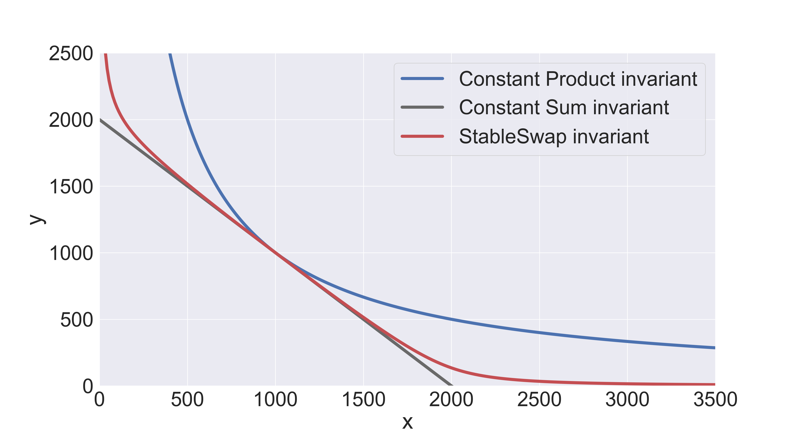
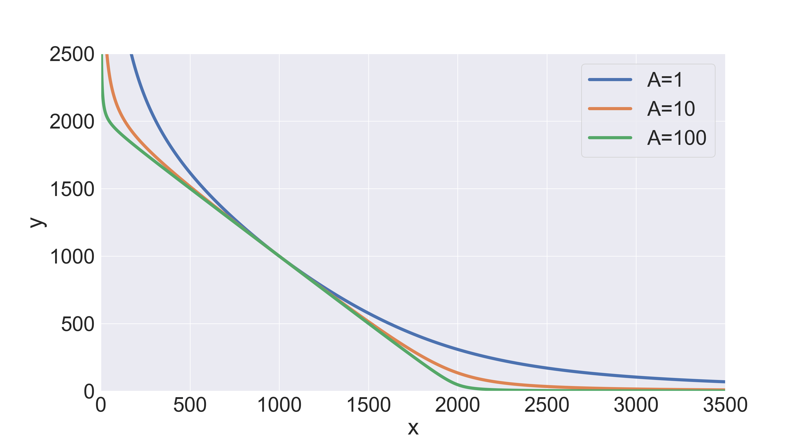
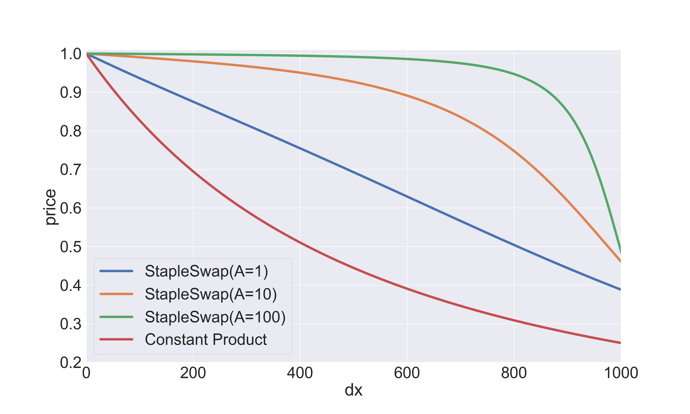

# Stable3Pool Protocol

Stablecoin exchanges require deep liquidity and no price slippage (best case scenario).
Classic constant product Automated Market Makers pool (AMM pools) are good for highly volatile assets, however,
constant product invariant formula ($xy = c$) don't meet the requirements above for stablecoins.
A more complex invariant as the heart of the AMM pool is needed to effectively utilize stablecoins' liquidity.

The most appropriate invariant for constructing AMM pools with stable coins is
StableSwap invariant proposed by [Curve](https://classic.curve.fi/files/stableswap-paper.pdf).
Curve's invariant combines the pros and cons of the simplest AMM invariants and in its sense is a superposition of
constant sum $\sum x_i = c$ and constant product $\prod x_i = c$ formulas:

```math
\begin{equation}
A n^n \sum x_i + D = D A n^n + \frac{D^{n + 1}}{n^n \prod x_i}
\end{equation}
```

where $x_i$ represents the balance of $i^{th}$ token in the pool, $D = \sum x_i$
is the total amount of tokens when they have an equal price i.e. at equilibrium when all tokens have equal balance,
$A$ is a parameter and $n$ is the number of tokens in the pool.

The StableSwap invariant indeed provides both low price slippage around equal price point
and deep liquidity, it can be clearly seen from the direct curves' comparison:


The shape of the StableSwap invariant's curve strongly depends on the value of the parameter $A$.
It's called an “amplification coefficient”, the lower it is, the closer the invariant is to the constant product:




If the price appears to be shifted from equilibrium point, the invariant
starts operating in a suboptimal point, still, however, providing some liquidity (in
most cases larger than constant product invariant, if optimal $A$ was correctly found).
At any price, this invariant, just like a constant-product one, would
provide some liquidity (unlike the constant-sum invariant).

Value of the parameter $A$ should be chosen in such a way, that the price remains favorable for traders
playing on arbitrage, and, at the same time, trading volume (due to the low fees)
remains large enough for liquidity providers to receive high returns (this can be simulated using historical data).

## Invariant calculation

Let us write again the invariant for the effective stablecoin exchange:

```math
\begin{equation}
A n^n \sum x_i + D = D A n^n + \frac{D^{n + 1}}{n^n \prod x_i}
\end{equation}
```

Parameters $n$ and $A$ are constants, thus, set of variables involved in the
invariant calculation is $(\{x_i\}_{i = 1}^{n}, D)$.
However, analytically calculate the value of one of them when the values of all others are known
is possible only for $n = 2$.
When pool consists of $n = 3$ assets and more the only way to calculate target values of the
invariants' variables is to solve it numerically.
Numerical solution methods are usually used to solve equations that are too difficult for us to solve by hand.
Each method is an iterative process that can approximate solutions to an equation with a predefined accuracy.

There are many numerical methods to choose from, so let us fix the requirements for the particular problem.
A solution algorithm for the StableSwap invariant must be:

- Effective (small number of iterations and low memory consumption);
- Precise (with precision to a discrete unit of the target variable).

The simplest numerical method that satisfies the efficiency requirements is the well-known Newton-Raphson Method.
To find the roots of the equation $f(x) = 0$, the following equation is iterated until a sufficiently precise value is
reached:

```math
\begin{equation}
x_{n + 1} = x_n - \frac{f(x_n)}{f'(x_n)}
\end{equation}
```

where $f(x_n)$ is continuously differentiable in the vicinity of the root (StableSwap satisfies this property).

Let’s say the trader wants to know the amount of $j$ tokens he will
receive for trading $\delta x_i ~(i \neq j)$ amount of token $i$.
In this case, the input token is $i$, and the output token
is $j$. The updated amount of $i$ in the pool is $x = x_i + \delta x_i$.
Since the token amounts always need to follow the StableSwap invariant,
updated $j$ token amount $x_j = y$ can be calculated by numerically solving equation
for $y$ with fixed amount of $i$ equal to $x$.
Let’s rearrange the invariant's equation:

```math
\begin{equation}
f(y) = y^2 + (b - D)y - c = 0,
\end{equation}
```

where

```math
b = S + \frac{D}{Ann},~~~~~c=\frac{D^{n + 1}}{n^n P Ann},
 ~~~~~ S = \sum_{i \not = j}^{n} x_i, ~~~~~ and ~~~~~ P = \prod_{i \not = j}^{n} x_i
```

The root of the above equation can be calculated using Newton’s method by iterating the below equation until
convergence:

```math
\begin{equation}
y_{n + 1} = y_n - \frac{y_n^2 + (b - D) y - c}{2 y_n + b - D} = \frac{y_n^2 + c}{2 y_n + b - D}
\end{equation}
```

Iteration obviously doesn't have to be infinite.
The condition for stopping the numerical calculation procedure is $y_{n + 1} - y_{n} <= 1$.
However, $1$ is just the minimal grid step and the step calculated from Newton’s method may be less than $1$ in the
last iterations.
Thus, we will carry out additional calculation steps to find the extremum of the invariant error function.

Let $I_{n*} = f(y_{n*})$ be the invariant calculation error of the numeric solution.
We calculate $I_{n* + 1} = f(y_{n* + 1})$ and $I_{n* - 1} = f(y_{n* - 1})$ and, if $I_{n* - 1} > I_{n*} < I_{n* + 1}$
then $y_{n*}$ is the final solution.
If not, we continue to shift to the right until the extremum condition is met (usually this doesn't more than 2 steps).

Finally, the amount of token $j$ to be received by the trader can be calculated as ${dy = y_{init} - y_{fin}}$,
where $y_{init}$ is the balance of token $j$
before the trade and $y_{fin}$ is the updated balance calculated from equation above.

The value of parameter $D$ is calculated by solving the invariant in the same way as described above.
Given all other parameters are constant, the function $f(D)$, which a polynomial function of degree ${n + 1}$
can be represented as

```math
\begin{equation}
f(D) = \frac{D^{n + 1}}{n^n \prod x_i} + (Ann - 1) D - Ann S = 0
\end{equation}
```

where $S = \sum x_i$. The derivative of above function is ${f'(D) = (n + 1) D_P / D + (Ann - 1)}$,
where ${D_P = \frac{D^{n + 1}}{n^n \prod x_i}}$.
Therefore, the root of ${f(D) = 0}$
can be calculated using Newton's formula by iterating below equation until convergence:

```math
\begin{equation}
D_{n + 1} = D_n - \frac{f(D_n)}{f'(D_n)} = \frac{(Ann S + n D_P) D_n}{(Ann - 1) D_n+(n + 1) D_P}
\end{equation}
```

And, in the same manner, we adjust $D_{n*}$ solution to ensure that it is an extremum of the invariant error.

## eUTXO protocol design

### Stable3Pool

#### Data

Data related to the pool (`Immutable` stands for pool configuration parameters) is as follows:

| Field                       | Type            | Description                                                                                                                         | State       |
| --------------------------- | --------------- | ----------------------------------------------------------------------------------------------------------------------------------- | ----------- |
| `treasury_nft`              | `Asset`         | Identifier of the treasury                                                                                                          | `Immutable` |
| `base_token`                | `Asset`         | Identifier of the base asset                                                                                                        | `Immutable` |
| `quote_token0`              | `Asset`         | Identifier of the first quote asset                                                                                                 | `Immutable` |
| `quote_token1`              | `Asset`         | Identifier of the second quote asset                                                                                                | `Immutable` |
| `lp_token`                  | `Asset`         | Identifier of the liquidity token asset                                                                                             | `Immutable` |
| `base_token_dec`            | `Integer`       | Decimals of the base asset                                                                                                          | `Immutable` |
| `quote_token0_dec`          | `Integer`       | Decimals of the first quote asset                                                                                                   | `Immutable` |
| `quote_token1_dec`          | `Integer`       | Decimals of the second quote asset                                                                                                  | `Immutable` |
| `denom`                     | `Integer`       | Common denominator of calculations                                                                                                  | `Immutable` |
| `precision`                 | `Integer`       | Precision multiplier for calculations <br/> (`precision >= MAX(base_token_decimals, quote_token0_decimals, quote_token1_decimals)`) | `Immutable` |
| `ampl_coeff_bounds`         | `List<Integer>` | Bounds of the `ampl_coeff`: `[lower_bound, upper_bound]`                                                                            | `Immutable` |
| `provider_fee_num_bounds`   | `List<Integer>` | Bounds of the  `provider_fee_num`        : `[lower_bound, upper_bound]`                                                             | `Immutable` |
| `protocol_share_num_bounds` | `List<Integer>` | Bounds of the `protocol_share_num`            : `[lower_bound, upper_bound]`                                                        | `Immutable` |
| `ampl_coeff`                | `Integer`       | Invariant's amplification coefficient                                                                                               | `Mutable`   |
| `provider_fee_num`          | `Integer`       | Numerator of the swap fee                                                                                                           | `Mutable`   |
| `protocol_share_num`        | `Integer`       | Numerator of the protocol fee share                                                                                                 | `Mutable`   |
| `inv_no_fees`               | `Integer`       | Value of the pool's invariant before applying fees to the last operation with pool's liquidity                                      | `Mutable`   |
| `inv`                       | `Integer`       | Actual value of the pool's invariant                                                                                                | `Mutable`   |

#### Tokens

| Name       | Description                             | Amount                                 |
| ---------- | --------------------------------------- | -------------------------------------- |
| `pool_NFT` | NFT to identify the pool                | `1`                                    |
| `X`        | Base asset token                        | `1` to `0x7fffffffffffffffL`           |
| `Y`        | First quote asset token                 | `1` to `0x7fffffffffffffffL`           |
| `Z`        | Second quote asset token                | `1` to `0x7fffffffffffffffL`           |
| `LP`       | Liquidity token of the  `X/Y/Z` triplet | Emission must be `0x7fffffffffffffffL` |

#### Validator

Pool validator must validate that:
1. Immutable pool configuration parameters are preserved;
2. Validator script is preserved;
3. Treasury is valid (to collect protocol fees);
4. Action is valid:
   1. Mmutable parameters are changed by voting:
      1. Valid voting results;
      2. New parameters are inside their bounds;
      3. Reserves are preserved.
   2. Deposit/Redeem:
      1. Fair fees was paid according to the assets imbalance:
         1. Procolols fees are >= than delta of the corresponding asset.
         2. Theoretical StableSwap invariant value is at the minimum error point (relative to LP);
      2. Actual StableSwap invariant value is at the minimum error point (relative to LP);
      3. Reserves changes are valid.
   3. Swap:
      1. Fair fees was paid:
         1. Protocol fees are >= than delta of the corresponding asset.
         2. Theoretical StableSwap invariant value is at the minimum error point (relative to LP);
      2. Actual StableSwap invariant value is at the minimum error point (relative to LP);
      3. Reserves changes are valid.

### Deposit Order


| Field                    | Type                  | Description                                 |
| ------------------------ | --------------------- | ------------------------------------------- |
| `pool_nft`               | `Asset`               | Identifier of the target pool               |
| `redeemer`               | `VerificationKeyHash` | Redeemer public key                         |
| `min_expected_lp_amount` | `Int`                 | Minimum expected amount of liquidity tokens |

##### Tokens

| Name | Description | Amount    |
| ---- | ----------- | --------- |
| `X`  | Base asset  | Arbitrary |
| `Y`  | Quote asset | Arbitrary |
| `Z`  | Quote asset | Arbitrary |

#### Validator

Deposit order validator must validate that:
1. Order interacts with the desired pool;
2. Expected liquidity token amount is received by redeemer;
3. Redeemer is valid.

### Redeem Order


When redeem, user can specify an arbitrary number of tokens; if no tokens are specified, then redeem will be carried out according to the current ratio in the pool.

#### Data

| Field                        | Type                  | Description                          |
| ---------------------------- | --------------------- | ------------------------------------ |
| `pool_nft`                   | `Asset`               | Identifier of the target pool        |
| `redeemer`                   | `VerificationKeyHash` | Redeemer public key                  |
| `min_expected_base_amount`   | `Asset`               | Minimum expected amount of token `X` |
| `min_expected_quote0_amount` | `Asset`               | Minimum expected amount of token `Y` |
| `min_expected_quote1_amount` | `Asset`               | Minimum expected amount of token `Z` |

##### Tokens

| Name | Description | Amount    |
| ---- | ----------- | --------- |
| `LP` | Base asset  | Arbitrary |

#### Validator
Redeem order validator must validate that:
1. Order interacts with the desired pool;
2. Expected amount of `X/Y/Z` tokens is received by redeemer;
3. Redeemer is valid.

### Swap Order


| Field                       | Type                  | Description                                |
| --------------------------- | --------------------- | ------------------------------------------ |
| `pool_nft`                  | `Asset`               | Identifier of the target pool              |
| `redeemer`                  | `VerificationKeyHash` | Redeemer public key                        |
| `expected_quote_token`      | `Asset`               | Expected quote token identofoer            |
| `min_expected_quote_amount` | `Int`                 | Minimum expected amount of the quote token |

##### Tokens

| Name    | Description   | Amount    |
| ------- | ------------- | --------- |
| `X/Y/Z` | Token to swap | Arbitrary |

#### Validator

Swap order validator must validate that:
1. Order interacts with the desired pool;
2. Expected quote token and it's amount is received by redeemer;
3. Redeemer is valid.
